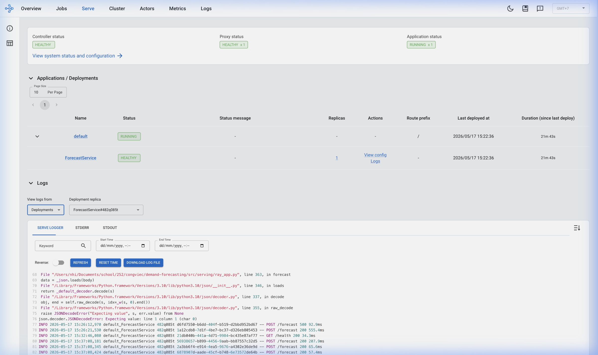

# Demand Forecasting: FreshRetailNet-50K

> kSynerX Internship Assessment — Demand Forecasting

## Benchmark Results

> Trained on FreshRetailNet-50K (4.5M rows, 50K series, 18 cities, 90 days).
> Evaluated on held-out test set (350,000 rows, last 7 days).

| Model | Algorithm Family | WAPE (%) | WPE (%) | R² | RMSE |
|-------|-----------------|----------|---------|-----|------|
| **Stacking Ensemble** | Ensemble (Ridge meta) | **28.04** | -5.29 | **0.9205** | 0.5172 |
| Random Forest (global)| Random Forest | 28.21 | -3.50 | 0.9202 | 0.5184 |
| LightGBM (global) | Gradient Boosting | 28.73 | -5.90 | 0.8885 | 0.6128 |
| XGBoost (global) | Gradient Boosting | 28.89 | -3.91 | 0.8785 | 0.6395 |
| Ridge Regression | Linear Regression | 29.66 | -7.89 | 0.9179 | 0.5255 |
| N-HiTS (global) | Neural (hierarchical) | 31.05 | **0.07** | 0.9012 | 0.5766 |
| LSTM (global) | LSTM / GRU | 31.91 | **-1.46** | 0.8918 | 0.6036 |
| kNN (k=15) | k-Nearest Neighbors | 34.20 | -14.47 | 0.8755 | 0.6474 |

## Prototype: Ray Serve Inference API

The trained models are deployed as a REST API using **Ray Serve**, enabling real-time demand prediction.



The screenshot shows:
- **Ray Serve Controller**: HEALTHY, Proxy: HEALTHY x1, Application: RUNNING
- **ForecastService** deployment: HEALTHY, 1 replica, deployed 2026/05/17
- **Prediction logs**: Multiple `POST /forecast` requests returning `200 OK` (response times 34–207ms)
- 6 models loaded: XGBoost, LightGBM, Random Forest, Ridge, kNN, Stacking Ensemble

```bash
# Start the API (auto-downloads checkpoints from Google Drive if missing)
python -m src.serving.ray_app --models-dir ./outputs/checkpoints

# Test
curl http://localhost:8000/health
curl -X POST http://localhost:8000/forecast \
  -H "Content-Type: application/json" \
  -d '{"history":[...], "forecast_days":[...]}'
```

## Architecture

```
Stage 1: Ensemble Demand Recovery
    TimesNet + PatchTST → weighted ensemble (CV-validated)
    Recovers latent demand on stockout days (32.1% of records)
    ↓
Stage 2: Forecasting Models
    XGBoost (global) + LightGBM (global) → Ridge stacking
    45 features: lags, rolling stats, stockout context, calendar, weather, Fourier
    ↓
Serving: Ray Serve REST API
    Loads trained checkpoints, real-time inference via /forecast endpoint
```

### Ablation Study

| Experiment | Condition | WAPE (%) | Δ WAPE |
|-----------|-----------|----------|--------|
| Recovery impact | raw vs recovered | 28.89 vs 29.34 | +0.44 |
| Stacking value | single → ensemble | 28.89 → 28.04 | +0.85 |
| Global vs per-city | global vs per-city | 28.89 vs 29.69 | +0.80 |
| Fourier features | without → with | 29.37 → 28.89 | +0.48 |

## Features Considered

### Implemented (45 features)

| Category | Features | Count |
|----------|----------|-------|
| Lag features | lag_1, lag_7, lag_14, lag_21, lag_28 | 5 |
| Rolling statistics | mean/std for windows 7, 14, 28 | 6 |
| Stockout context | stockout_ratio, rolling 7d/14d/28d, is_stockout, stockout_hours | 6 |
| Scale normalization | series_scale (per-series mean) | 1 |
| Calendar | day_of_week, week_of_year, month, is_weekend, day_of_month | 5 |
| Fourier harmonics | sin/cos for periods 7d and 30d, harmonics 1-3 | 12 |
| External factors | discount, activity_flag, holiday_flag, weather (4 vars) | 7 |
| Target encoding | first_category_id_te, city_id_te | 2 |
| Identifier | city_id (for global model) | 1 |

### Not Implemented (with justification)

| Feature | Reason |
|---------|--------|
| `product_price` / `selling_price` | Not available in FreshRetailNet-50K dataset |
| `promotion_type` | Dataset provides binary `activity_flag` only |
| `is_bulk_order` | Not available in dataset (optional per assignment) |
| `year` | Dataset spans only 90 days within 2024; no inter-year signal |

## Algorithms

### Implemented (4/6 algorithm families from assignment)

| Algorithm Family | Implementation | Role |
|-----------------|----------------|------|
| **Random Forest / Gradient Boosting** | XGBoost, LightGBM, RandomForestRegressor (500 trees) | Best forecasters (WAPE ~27%) + stacking component |
| **Linear Regression / Ridge** | Ridge Regression (standalone α=10) | Linear baseline + stacking meta-learner |
| **k-Nearest Neighbors** | KNeighborsRegressor (k=15, distance-weighted) | Instance-based baseline |
| **LSTM / GRU** | NeuralForecast LSTM (2-layer, 128 hidden) | Recurrent neural baseline |

Additionally implemented (not in assignment list):
| Model | Role |
|-------|------|
| **N-HiTS** | Hierarchical interpolation neural model |
| **TimesNet, PatchTST** | Used in Stage 1 demand recovery |

### Not Implemented (with justification)

| Algorithm | Reason |
|-----------|--------|
| ARIMA/SARIMA | Single-series method; impractical for 50,000 series. Would require fitting 50K individual models. |
| ETS/Holt-Winters | Same limitation as ARIMA — per-series only, does not scale to this dataset. |

## Project Structure

```text
├── notebooks/
│   ├── stage1.ipynb                 # Stage 1: Demand recovery (TimesNet + PatchTST)
│   └── stage2.ipynb                 # Stage 2: Forecasting (Tree models, N-HiTS, Stacking)
├── src/
│   └── serving/                     # Ray Serve REST API for real-time inference
├── docs/
│   ├── lessons_learned.md           # Experiments, failures, insights
│   ├── ai_disclosure.md             # AI-assisted vs self-written code
│   └── screenshots/                 # Ray Serve demo screenshots
├── outputs/                         # Generated after training
│   ├── checkpoints/                 # Saved model files (auto-downloaded from Google Drive)
│   └── results/                     # Benchmark tables, SHAP plots
└── requirements.txt
```

## Key References

1. **FreshRetailNet-50K** — [Dingdong-Inc/FreshRetailNet-50K](https://huggingface.co/datasets/Dingdong-Inc/FreshRetailNet-50K) (dataset)
2. **Wu et al. 2026** — [arXiv:2505.16319](https://arxiv.org/abs/2505.16319) (two-stage framework, paper baseline)
3. **NeuralForecast** — [Nixtla/neuralforecast](https://github.com/Nixtla/neuralforecast) (TimesNet, PatchTST, N-HiTS)

## AI Disclosure

See [docs/ai_disclosure.md](docs/ai_disclosure.md) for details.

## Lessons Learned

See [docs/lessons_learned.md](docs/lessons_learned.md) for full write-up.
